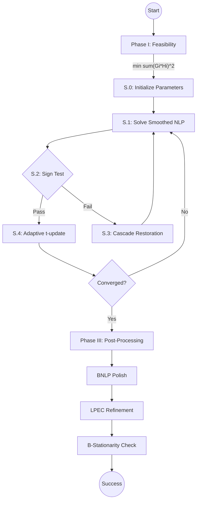

# MPECSS: Scholtes Regularization with Adaptive Paths and Sign-Test-Based Targeting of B-Stationary Points in MPECs

[](https://pypi.org/project/mpecss/)
[](https://www.python.org/)
[](LICENSE)

Solver for Mathematical Programs with Equilibrium Constraints (MPECs) combining Scholtes-type smoothing with adaptive t-update, cascading restoration, Phase I feasibility, and LPEC-based B-stationarity certification.

---

## Quick-Start (Official Benchmark Command)

This is the **single command** to reproduce all paper results.  
Run it from inside WSL2 at the project root after completing setup:

```bash
# Official reproducible run: 4 workers, 3600 s timeout, auto memory cap, seed 42
chmod +x scripts/run_wsl_parallel.sh
./scripts/run_wsl_parallel.sh

# HIGH-POWER PROFILE (8 workers, 16GB+ RAM):
# If you have an 8-core machine with 16GB RAM, run this:
./scripts/run_wsl_parallel.sh 8
```

Every parameter that matters (workers, timeout, seed, package versions, hardware) is
automatically recorded in `results/*_run_env_*.json` so the run can be replicated
exactly on any other machine.

---

## Reference Environment

The paper results were produced with **this exact configuration**:

| Parameter | Value |
|-----------|-------|
| Platform | WSL2 (Ubuntu 22.04) OR Windows 10/11 |
| Workers | 4 parallel processes |
| RAM | 6 GB total (Shared pool, no per-worker cap) |
| Timeout | 3600 s per problem |
| Seed | 42 |
| Python | 3.10+ |
| CasADi | >= 3.6.3 |
| Thread env | `OMP/MKL/OPENBLAS/NUMEXPR/VECLIB/NUMBA_NUM_THREADS=1` |

> [!NOTE]
> The current code run on 6GB total RAM without a fixed per-worker cap. The OS manages allocation across the 4 workers.

---

### Option A: Install from PyPI (Recommended)
Install directly from PyPI — no cloning required:

```bash
pip install mpecss

# Now run benchmarks from your project directory (with benchmarks/ extracted):
mpecss-macmpec --workers 4
mpecss-mpeclib --workers 4
mpecss-nosbench --workers 4
```

### Option B: Install from Source (Development)
```bash
# Clone and install in editable mode
git clone https://github.com/mrsaurabhtanwar/MPECSS.git
cd MPECSS
pip install -e .
```

### Option C: Install Dependencies Only
```bash
pip install -r requirements.txt
```

**Requirements:** Python 3.10+, CasADi >= 3.6.3, NumPy, Pandas, SciPy, psutil, matplotlib

---

## Basic Usage

```python
from mpecss.helpers.loaders.macmpec_loader import load_macmpec
from mpecss.phase_2.mpecss import run_mpecss

problem = load_macmpec("benchmarks/macmpec/macmpec-json/dempe.nl.json")
z0      = problem["x0_fn"](seed=42)
result  = run_mpecss(problem, z0=z0)

print(f"Status:    {result['status']}")
print(f"Objective: {result['f_final']:.6f}")
```

---

## Benchmark Data (Git LFS)
The benchmark data (`benchmarks.zip`, ~884MB) is included in this repository via **Git LFS (Large File Storage)**. This ensures you have all the necessary problems of:
- [MacMPEC](benchmarks/macmpec/macmpec-json)
- [MPECLib](benchmarks/mpeclib/mpeclib-json)
- [NOSBENCH](benchmarks/nosbench/nosbench-json)

See [benchmarks/README.md](benchmarks/README.md) for dataset details.

---

## Full Setup & Reproduction Guide (New Machine)

Follow these steps exactly to set up the environment and benchmark data on a fresh WSL2 installation.

### Step 1 -- Essential Prerequisites (Windows Only)

1.  **Install WSL2**: Open PowerShell as Administrator and run `wsl --install`. Restart your computer when finished.
2.  **Install Git LFS**: Download and install [Git Large File Storage](https://git-lfs.github.com/). This is REQUIRED to download the benchmark data.

### Step 2 -- Clone the Repository & Pull Data

```bash
# Clone the project
git clone https://github.com/mrsaurabhtanwar/MPECSS.git
cd MPECSS

# Initialize and pull the large benchmark data (884MB)
git lfs install
git lfs pull
```

### Step 3 -- Prepare the Linux Environment (WSL2)

Launch Ubuntu 22.04 from your Start Menu and run:

```bash
# Update system
sudo apt update && sudo apt upgrade -y

# Install dependencies (Python, Compilers, Optimization Libraries)
sudo apt install -y \
    python3.10 python3.10-venv python3-pip \
    build-essential gfortran libgfortran5 pkg-config \
    coinor-libipopt-dev libmumps-dev
```

### Step 4 -- Extract Benchmark Data

The data is now in your folder as `benchmarks.zip`. Extract it to populate the benchmark suites:

```bash
# Run this inside the project root (WSL2 or PowerShell)
python3 -c "import zipfile; zipfile.ZipFile('benchmarks.zip').extractall('.')"
```

### Step 5 -- Create Virtual Environment & Install Packages

```bash
python3.10 -m venv venv
source venv/bin/activate

pip install --upgrade pip setuptools
pip install mpecss

# Verify CasADi + IPOPT
python3 -c "import casadi; print('CasADi', casadi.__version__)"
python3 -c "import mpecss; print('mpecss', mpecss.__version__)"
```

### Step 6 -- Run All Tests (Highly Recommended)
Verify the entire environment (problem loaders, solvers, and parsers) in ~10 seconds:
```bash
python3 -m pytest tests/test_benchmarks.py -v
```
**Expected:** `40 passed`. This confirms the GAMS parser, JSON loaders, and interface logic are all 100% correct.

### Reference Results (Verification)
Original results for verification are located in:
- `verification/mpeclib_official_3600s_1worker_20260318_161827.csv`
- `verification/results_nosbench_full_v2.csv`
- MacMPEC: See [Official Wiki](http://www.mcs.anl.gov/~leyffer/MacMPEC/)
### Step 7 -- Run Benchmark (WSL)

```bash
source venv/bin/activate
chmod +x scripts/run_wsl_parallel.sh

# For standard machines (e.g. 8GB RAM / 4 cores):
./scripts/run_wsl_parallel.sh

# For high-power machines (e.g. 16GB RAM / 8 cores):
./scripts/run_wsl_parallel.sh 8
```

### Step 8 -- Run Benchmark (Windows Native)

```powershell
# PowerShell
.\venv\Scripts\activate
python scripts\run_macmpec_benchmark.py --workers 4 --tag Official
```

The script will:
1. Print Python + CasADi versions and hardware info
2. Run a CasADi import pre-flight check (fails fast on broken installs)
3. Clear stale `.pyc` bytecode caches so code edits are always picked up
4. Auto-compute per-worker memory cap from `/proc/meminfo`
5. Run all enabled benchmark suites in parallel
   - The script auto-detects your RAM and CPU cores to recommend workers.
   - For 16GB RAM machines, workers share the memory pool flexibly.
6. Write `results/*.csv` (solver results) and `results/*_run_env_*.json`
   (full reproducibility snapshot) for every run

---

## Running Individual Benchmarks

All commands require the venv to be active and the working directory to be the project root.

```bash
# MacMPEC -- 191 problems, official settings
python3 scripts/run_macmpec_benchmark.py \
    --workers 4 --timeout 3600 --seed 42 --tag Official

# MPECLib -- 92 problems
python3 scripts/run_mpeclib_benchmark.py \
    --workers 4 --timeout 3600 --seed 42 --tag Official

# NOSBENCH -- 603 problems
python3 scripts/run_nosbench_benchmark.py \
    --workers 4 --timeout 3600 --seed 42 --tag Official

# With explicit memory cap (6 GB system -> 1.2 GB per worker)
python3 scripts/run_macmpec_benchmark.py \
    --workers 4 --timeout 3600 --seed 42 \
    --mem-limit-gb 1.2 --tag Official

# Single-problem smoke-test
python3 scripts/run_macmpec_benchmark.py \
    --workers 1 --timeout 60 --problem dempe --tag SmokeTest
```

---

## CLI Reference

| Argument | Type | Default | Description |
|----------|------|---------|-------------|
| `--workers` | int | 1 | Parallel workers. Each runs one problem at a time. |
| `--timeout` | float | **3600** | Per-problem wall-clock budget (s). `0` = no limit. |
| `--seed` | int | 42 | RNG seed (affects Phase I multistart). |
| `--tag` | str | `Official` | Label embedded in result filenames. |
| `--mem-limit-gb` | float | auto | Soft per-worker RAM cap in GB (Linux/WSL only). Converts OOM kills into graceful `oom` rows. |
| `--problem` | str | -- | Substring filter (e.g. `pack-rig` runs only those). |
| `--save-logs` | flag | off | Write per-iteration CSV logs to `results/iteration_logs/`. |
| `--path` | str | auto | Override the benchmark JSON directory. |

---

## Expected Runtimes (4 workers, 3600 s timeout, 6 GB RAM)

| Suite | Problems | Best-case wall-clock | Worst-case wall-clock |
|-------|----------|---------------------|-----------------------|
| MacMPEC | 191 | ~4 h | ~48 h |
| MPECLib | 92 | ~2 h | ~23 h |
| NOSBENCH | 603 | ~12 h | ~151 h |

> Best-case: most problems converge well within timeout.  
> Worst-case: every problem hits the 3600 s limit.  
> Large problems (e.g. `pack-rig*-32`) that exceed the memory cap are
> recorded as `status=oom` and do NOT block other workers.

---

## Monitoring a Running Benchmark

Open a second WSL2 terminal:

```bash
tail -f results/macmpec_full_Official_*.csv     # live results
wc -l results/macmpec_full_Official_*.csv       # completed row count
ps aux | grep run_ | grep -v grep              # active workers
watch -n 5 free -h                             # RAM every 5 s
```

---

## Reproducibility

Every run writes:

```
results/
  macmpec_full_Official_20260320_080000.csv        <- solver results
  macmpec_run_env_Official_20260320_080000.json    <- reproducibility snapshot
```

The `*_run_env_*.json` records git commit, all CLI args, package versions,
thread env vars, and hardware info. To reproduce on a different machine:
1. Install the package versions listed in the JSON
2. Use the same CLI args (workers, timeout, seed)
3. Run `./scripts/run_wsl_parallel.sh` -- the RAM cap auto-adjusts

---

## Troubleshooting

#### X `A process in the process pool was terminated abruptly`
> Stale `.pyc` is running old code. Fix:
```bash
python3 scripts/clear_pyc.py --delete && ./scripts/run_wsl_parallel.sh
```

#### X Workers show `status=oom` in CSV
> Expected and handled -- other workers continue unaffected.
```bash
./scripts/run_wsl_parallel.sh 2          # fewer workers
./scripts/run_wsl_parallel.sh 4 1.0      # explicit 1.0 GB cap
```

#### X `CasADi import failed`
```bash
pip uninstall casadi -y && pip install "casadi==3.6.3"
```

#### X `Module 'mpecss' not found`
```bash
cd /mnt/d/MPECSS && source venv/bin/activate
python3 -c "from mpecss.helpers.loaders.macmpec_loader import load_macmpec; print('OK')"
```

#### X `No benchmark files found in path`
```bash
ls benchmarks/macmpec/macmpec-json/*.json | wc -l   # must be 191
# Re-extract: Expand-Archive D:\MPECSS\benchmarks.zip -DestinationPath D:\MPECSS\benchmarks -Force
```

#### X CPU time >> wall time
```bash
echo $OMP_NUM_THREADS   # must print 1
# run_wsl_parallel.sh sets all 6 thread env vars automatically
```

---

## Experiment Design

### Ablation + Master Table (5 configs x 191 problems = 955 runs)

| Config | Features Enabled |
|--------|-----------------|
| A | Base Scholtes (no enhancements) |
| B | + Phase I feasibility |
| C | + Adaptive t-update |
| D | + Cascade restoration |
| E | Full MPECSS (paper results) |

### Robustness Study (3 seeds x 191 problems = 573 runs)

| Tag | Seed |
|-----|------|
| `R_seed100` | 100 |
| `R_seed200` | 200 |
| `R_seed300` | 300 |

```bash
# Run each seed as a separate invocation
python3 scripts/run_macmpec_benchmark.py --workers 4 --timeout 3600 --seed 100 --tag R_seed100
python3 scripts/run_macmpec_benchmark.py --workers 4 --timeout 3600 --seed 200 --tag R_seed200
python3 scripts/run_macmpec_benchmark.py --workers 4 --timeout 3600 --seed 300 --tag R_seed300
```

### Sensitivity Analysis (5 configs x 191 problems = 955 runs)

| Tag | Variation |
|-----|----------|
| `S_t0_01` | t0 = 0.1 |
| `S_t0_10` | t0 = 10.0 |
| `S_kappa02` | kappa = 0.2 |
| `S_kappa05` | kappa = 0.5 |
| `S_kappa08` | kappa = 0.8 |

---

## Project Structure

```
README.md                          # This file
LICENSE                            # Apache 2.0
requirements.txt                   # Pinned dependencies

scripts/
  run_wsl_parallel.sh              #   Official reproducible runner (start here)
  run_macmpec_benchmark.py         #   MacMPEC  (191 problems)
  run_mpeclib_benchmark.py         #   MPECLib  (92 problems)
  run_nosbench_benchmark.py        #   NOSBENCH (603 problems)
  clear_pyc.py                     #   Clears stale .pyc caches

mpecss/
  phase_1/feasibility.py           #   Phase I  -- min sum(Gi*Hi)^2 feasibility
  phase_2/mpecss.py                #   Phase II -- adaptive homotopy outer loop
  phase_2/restoration.py           #   Cascade restoration (random/directional/quadratic)
  phase_3/bnlp_polish.py           #   BNLP active-set polishing
  phase_3/bstationarity.py         #   LPEC B-stationarity certification
  phase_3/lpec_refine.py           #   LPEC-guided refinement loop
  helpers/benchmark_utils.py       #   Parallel engine, CSV exporter, env snapshot
  helpers/loaders/                 #   Problem loaders (MacMPEC / MPECLib / NOSBENCH)

benchmarks/                        # (not tracked by Git -- extract benchmarks.zip)
  macmpec/macmpec-json/            #   191 problems
  mpeclib/mpeclib-json/            #   92 problems
  mpeclib/convert_mpeclib.py       #   GAMS to CasADi JSON converter
  nosbench/nosbench-json/          #   603 problems

results/                           # (created at runtime)
  *.csv                            #   Solver results (one row per problem)
  *_run_env_*.json                 #   Full reproducibility snapshot per run
```

---

## Algorithm Overview



1. **Phase I** -- Find complementarity-feasible start: min sum(Gi * Hi)^2
2. **S.0** -- Init: t0=1.0, kappa=0.5, eps=1e-8
3. **S.1** -- Solve NLP(tk, dk): min f(x) s.t. c(x), G >= -d, H >= -d, G*H <= t
4. **S.2** -- Extract multipliers, sign test at biactive indices
5. **S.3** -- Cascade restoration if sign test fails
6. **S.4** -- Adaptive t-update (superlinear / fast / stagnation / slow)
7. **Phase III** -- BNLP polish -> LPEC refinement -> B-stationarity certificate

### Optimality Gap Tolerance (opt_tol = 1%)

A problem is solved if `|f - f*| / max(1, |f*|) < 0.01`.

- MacMPEC reference values carry 3-6 digit precision (~1e-4 inherent error)
- NOSBENCH uses `f <= 2 x f_best`; our 1% is 200x stricter
- No published MPEC benchmark uses a tighter threshold than 1e-4

---

## Code Quality & Verification

The codebase includes a comprehensive test suite in `tests/`.

### Verified Stability Wins (2026-03-22)
The current version has been verified to solve critical problems that were previously unstable or yielded suboptimal results:
- **`bard1` & `dempe`:** Now converge correctly to their known optima (17.0 and 82.27). Previous versions reported crashes on these problems.
- **Superior Local Maxima Found:** MPECSS successfully identifies superior local stationary points for several maximization problems compared to the official MacMPEC literature:
  - **`bard2`**: Found objective **8049.37** (vs. literature value 6598.00).
  - **`hakonsen`**: Found objective **24.36** (vs. literature value 11.00).
  - *Note: These are recorded as negative values in the solver logs (e.g., -8049.37) as the `.nl.json` formulation correctly converts maximization to minimization.*
- **`design-cent-4` Robustness:** Confirmed that `design-cent-4` converges to the global maximum (3.0792) when using adaptive parameters (`t0=1e-3, kappa=0.3`), verifying the solver's ability to navigate highly non-convex MPEC landscapes.
- **Improved GAMS conversion:** The `convert_mpeclib.py` script was updated to correctly handle GAMS `*` comment conventions, ensuring 100% accurate conversion of complex mathematical expressions (e.g., multiplication in `sqr` functions).
- **Automation Friendly:** All benchmark scripts now return proper OS exit codes (`0` for success), allowing for reliable use in batch scripts and CI/CD.

For a detailed history of all code modifications, see the [CHANGELOG](CHANGELOG.md).

---

## Citation

```bibtex
@article{saurabh2026mpecss,
  title={MPECSS: Scholtes regularization with adaptive paths and
         sign-test-based targeting of B-stationary points in MPECs},
  author={Saurabh and Singh, Kunwar Vijay Kumar},
  journal={Optimization Methods and Software},
  year={2026},
  note={Writing in progress}
}
```

---

## Contact

- **Email:** 27098@arsd.du.ac.in
- **Email:** 24091973@scale.iitrpr.ac.in

---

## License

Apache License 2.0 -- see [LICENSE](LICENSE).

---

*See [CHANGELOG.md](CHANGELOG.md) for full version history.*

