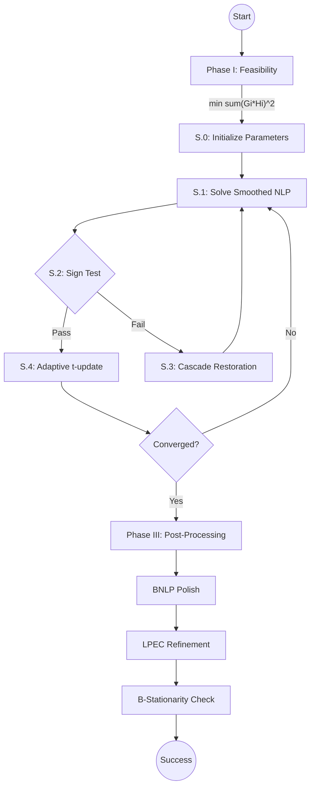

# MPECSS: Scholtes Regularization with Adaptive Paths for Targeting S- or B- Stationary Points in MPECs

[](https://pypi.org/project/mpecss/)
[](https://www.python.org/)
[](LICENSE)

---

## What is MPECSS?

**MPECSS** (Mathematical Program with Equilibrium Constraints — Scholtes Smoothing) is an algorithm for difficult class of optimization problems called **MPECs** (Mathematical Programs with Equilibrium Constraints), also known as **MPCCs** (Mathematical Programs with Complementarity Constraints).

### What are MPECs?

An MPEC is an optimization problem where some constraints take the form of **complementarity conditions**:

```
minimize    f(x)
subject to  g(x) <= 0
            G(x) >= 0,  H(x) >= 0,  G(x) * H(x) = 0   <-- complementarity
```

The complementarity constraint `G(x) * H(x) = 0` means that at every point, *at least one* of `G(x)` or `H(x)` must be zero. This creates a non-convex, combinatorial structure that makes MPECs extremely challenging for standard nonlinear solvers.

MPECs arise in:
- **Bilevel optimization** (Stackelberg games, hierarchical decision-making)
- **Traffic equilibrium** and network design
- **Contact mechanics** and friction modeling
- **Electricity market clearing** and game-theoretic models
- **Nonsmooth optimal control** (hybrid systems, switches)

### What does MPECSS do?

MPECSS implements a **Scholtes-type smoothing method** with several algorithmic innovations:

1. **Phase I (Feasibility)**: Finds a complementarity-feasible starting point by minimizing `sum(G*H)^2`
2. **Phase II (Smoothing)**: Replaces the hard complementarity constraint `G*H = 0` with a smooth relaxation `G*H <= t`, then drives the smoothing parameter `t -> 0` adaptively
3. **Adaptive t-update**: Automatically selects superlinear, fast, or slow reduction schedules based on solver progress
4. **Cascading restoration**: Recovers from solver failures using random perturbation, directional escape, or quadratic regularization
5. **Phase III (Certification)**: Polishes the solution with an active-set BNLP (Biactive NLP) and certifies **B-stationarity** via an LPEC (Linear Program with Equilibrium Constraints)

### What does this repository provide?

This repository contains:
- The **MPECSS solver** as a pip-installable Python package
- **Benchmark data** for 886 MPEC problems from three established test suites:
  - **MacMPEC** (191 problems) — classical academic MPEC test problems
  - **MPECLib** (92 problems) — structural, friction, traffic, and game-theoretic problems
  - **NOSBENCH** (603 problems) — nonsmooth optimal control problems discretized as MPCCs
- **Reproducible benchmark scripts** to replicate the results reported in the accompanying paper

---

## Prerequisites

Before installing MPECSS, ensure your system meets these requirements:

| Requirement | Details |
|-------------|---------|
| **Operating System** | Windows 10/11 with WSL2 (Ubuntu 22.04 recommended), or native Linux |
| **Python** | 3.10 or higher |
| **RAM** | Minimum 6 GB (8+ GB recommended for parallel runs) |
| **Disk Space** | ~1 GB for package + benchmark data; ~5 GB for full results |
| **Internet** | Required for pip install and Git LFS download |

### Software Dependencies (installed automatically via pip)

- CasADi >= 3.6.3 (provides IPOPT nonlinear solver)
- NumPy >= 1.24
- Pandas >= 2.0
- SciPy >= 1.11
- psutil >= 5.9
- matplotlib >= 3.7

---

## Installation

Choose **one** of the following installation methods.

### Option A: Install from PyPI (Recommended for Users)

This method installs MPECSS as a library. Use this if you want to solve your own MPEC problems or run the benchmark suites.

```bash
pip install mpecss
```

**To run the benchmark suites**, you must also download and extract the benchmark data (not included in the pip package):

```bash
# Step 1: Create a working directory
mkdir mpecss-workspace && cd mpecss-workspace

# Step 2: Download benchmarks.zip from GitHub Releases
# Visit: https://github.com/mrsaurabhtanwar/MPECSS/releases
# Download the benchmarks.zip file (~884 MB) and place it in this directory

# Step 3: Extract the benchmark data
python -m zipfile -e benchmarks.zip .

# Step 4: Verify extraction (should show 191 files)
ls benchmarks/macmpec/macmpec-json/*.json | wc -l
```

> [!WARNING]
> **Do NOT rename** `benchmarks.zip` before extracting, and **do NOT rename** the extracted folders. The CLI tools expect the exact directory structure: `benchmarks/macmpec/macmpec-json/`, `benchmarks/mpeclib/mpeclib-json/`, `benchmarks/nosbench/nosbench-json/`.

Now you can run the benchmark CLI commands from inside `mpecss-workspace/`:

```bash
# Run MacMPEC benchmark (191 problems)
mpecss-macmpec --workers 4

# Run MPECLib benchmark (92 problems)
mpecss-mpeclib --workers 4

# Run NOSBENCH benchmark (603 problems)
mpecss-nosbench --workers 4
```

### Option B: Install from Source (Recommended for Developers / Paper Reproduction)

This method clones the full repository including benchmark data. Use this for development or to reproduce the paper results exactly.

**Step 1: Clone the repository**

```bash
git clone https://github.com/mrsaurabhtanwar/MPECSS.git
cd MPECSS
```

**Step 2: Pull benchmark data via Git LFS**

The benchmark data (~884 MB) is stored using Git Large File Storage (LFS). If you have Git LFS installed:

```bash
git lfs install
git lfs pull
```

**Step 3: Extract the benchmark data**

```bash
# Extract benchmarks.zip to populate the benchmark directories
python -c "import zipfile; zipfile.ZipFile('benchmarks.zip').extractall('.')"

# Verify extraction succeeded (should print 191)
ls benchmarks/macmpec/macmpec-json/*.json | wc -l
```

> [!NOTE]
> If `git lfs pull` fails (e.g., LFS quota exceeded, or Git LFS not installed), manually download `benchmarks.zip` from the [GitHub Releases page](https://github.com/mrsaurabhtanwar/MPECSS/releases) and place it in the project root before extracting.

**Step 4: Install in editable mode**

```bash
pip install -e .
```

### Option C: Install Dependencies Only (No Package Install)

If you want to run the scripts directly without installing the package:

```bash
pip install -r requirements.txt
```

---

## Verify Installation

After installation, verify that everything works correctly.

### Check package imports

```bash
# Verify CasADi is installed and IPOPT is available
python -c "import casadi; print('CasADi', casadi.__version__)"

# Verify MPECSS is installed
python -c "import mpecss; print('mpecss', mpecss.__version__)"
```

Expected output:
```
CasADi 3.6.x
mpecss 1.0.2
```

### Run the test suite

From the project root (Option B only):

```bash
python -m pytest tests/test_benchmarks.py -v
```

**Expected:** `40 passed` in approximately 10 seconds. This confirms the GAMS parser, JSON loaders, and solver interface are all working correctly.

---

## Quick-Start: Solve a Single Problem

Here's a minimal example showing how to load a benchmark problem and solve it with MPECSS:

```python
from mpecss.helpers.loaders.macmpec_loader import load_macmpec
from mpecss.phase_2.mpecss import run_mpecss

# Load the "dempe" problem from the MacMPEC suite
problem = load_macmpec("benchmarks/macmpec/macmpec-json/dempe.nl.json")

# Generate an initial point with seed=42 for reproducibility
z0 = problem["x0_fn"](seed=42)

# Solve the problem
result = run_mpecss(problem, z0=z0)

# Print results
print(f"Status:       {result['status']}")
print(f"Objective:    {result['f_final']:.6f}")
print(f"Comp. resid.: {result['comp_res']:.2e}")
```

Expected output:
```
Status:       converged
Objective:    82.270000
Comp. resid.: 1.23e-09
```

---

## Full Setup & Reproduction Guide (New Machine)

This section provides a complete, linear walkthrough to set up MPECSS on a fresh Windows machine with WSL2 and reproduce the paper results. Follow each step in order.

### Before You Begin (Checklist)

- [ ] Windows 10 version 2004+ or Windows 11
- [ ] Administrator access (for WSL2 installation)
- [ ] At least 6 GB RAM available
- [ ] At least 10 GB free disk space
- [ ] Stable internet connection

---

### Step 1: Install WSL2 (Windows Only)

Open **PowerShell as Administrator** and run:

```powershell
wsl --install
```

Restart your computer when prompted. After restart, Ubuntu 22.04 will launch automatically to complete setup. Create a Unix username and password when prompted.

---

### Step 2: Install Git LFS (Windows)

Download and install [Git LFS](https://git-lfs.github.com/) on Windows. This is required to download the benchmark data during `git clone`.

---

### Step 3: Install Linux Dependencies (WSL2)

Launch **Ubuntu 22.04** from the Start Menu and run:

```bash
# Update package lists
sudo apt update && sudo apt upgrade -y

# Install Python 3.10 and development tools
sudo apt install -y \
    python3.10 python3.10-venv python3-pip \
    build-essential gfortran libgfortran5 pkg-config

# (Optional) Install IPOPT system libraries for better performance
sudo apt install -y coinor-libipopt-dev libmumps-dev
```

---

### Step 4: Clone the Repository

```bash
# Navigate to a working directory (adjust path as needed)
cd /mnt/d

# Clone the repository
git clone https://github.com/mrsaurabhtanwar/MPECSS.git
cd MPECSS

# Initialize Git LFS and pull benchmark data
git lfs install
git lfs pull
```

---

### Step 5: Extract Benchmark Data

```bash
# Extract the benchmark archive
python3 -c "import zipfile; zipfile.ZipFile('benchmarks.zip').extractall('.')"
```

**Verify the extraction succeeded:**

```bash
# Should print: 191
ls benchmarks/macmpec/macmpec-json/*.json | wc -l

# Should print: 92
ls benchmarks/mpeclib/mpeclib-json/*.json | wc -l

# Should print: 603
ls benchmarks/nosbench/nosbench-json/*.json | wc -l
```

> [!WARNING]
> If `git lfs pull` failed or the counts are wrong, manually download `benchmarks.zip` from the [GitHub Releases page](https://github.com/mrsaurabhtanwar/MPECSS/releases), place it in the project root, and re-run the extraction command.

---

### Step 6: Create Virtual Environment and Install MPECSS

```bash
# Create a virtual environment
python3.10 -m venv venv

# Activate the virtual environment
source venv/bin/activate

# Upgrade pip and setuptools
pip install --upgrade pip setuptools

# Install MPECSS and all dependencies
pip install -e .
```

---

### Step 7: Verify the Installation

```bash
# Ensure venv is active
source venv/bin/activate

# Check CasADi version
python3 -c "import casadi; print('CasADi', casadi.__version__)"

# Check MPECSS version
python3 -c "import mpecss; print('mpecss', mpecss.__version__)"

# Test the loader
python3 -c "from mpecss.helpers.loaders.macmpec_loader import load_macmpec; print('Loader OK')"
```

---

### Step 8: Run the Test Suite

```bash
# Ensure venv is active
source venv/bin/activate

# Run all tests
python3 -m pytest tests/test_benchmarks.py -v
```

**Expected:** `40 passed` in approximately 10 seconds.

---

### Step 9: Run the Full Benchmark (WSL2)

```bash
# Ensure venv is active
source venv/bin/activate

# Make the runner script executable
chmod +x scripts/run_wsl_parallel.sh

# Run with default settings (auto-detects cores and RAM)
./scripts/run_wsl_parallel.sh

# OR: Specify number of workers explicitly
./scripts/run_wsl_parallel.sh 4
```

The script will:
1. Print Python, CasADi versions, and hardware info
2. Clear stale `.pyc` bytecode caches
3. Auto-detect RAM and CPU cores to recommend worker count
4. Run all enabled benchmark suites in parallel
5. Write results to `results/*.csv` and reproducibility snapshots to `results/*_run_env_*.json`

---

### Step 9 (Alternative): Run Benchmark on Windows Native (PowerShell)

If you prefer to run directly on Windows without WSL2:

```powershell
# Navigate to the project directory
cd D:\MPECSS

# Activate the virtual environment
.\venv\Scripts\activate

# Run the MacMPEC benchmark
python scripts\run_macmpec_benchmark.py --workers 4 --tag Official
```

---

## Running Individual Benchmarks

All commands require the virtual environment to be active. Run from the project root directory.

### WSL2 / Linux

```bash
# Activate the virtual environment first
source venv/bin/activate

# MacMPEC -- 191 problems
python3 scripts/run_macmpec_benchmark.py \
    --workers 4 --timeout 3600 --seed 42 --tag Official

# MPECLib -- 92 problems
python3 scripts/run_mpeclib_benchmark.py \
    --workers 4 --timeout 3600 --seed 42 --tag Official

# NOSBENCH -- 603 problems
python3 scripts/run_nosbench_benchmark.py \
    --workers 4 --timeout 3600 --seed 42 --tag Official

# Single-problem smoke test
python3 scripts/run_macmpec_benchmark.py \
    --workers 1 --timeout 60 --problem dempe --tag SmokeTest
```

### Windows PowerShell

```powershell
# Activate the virtual environment first
.\venv\Scripts\activate

# MacMPEC -- 191 problems
python scripts\run_macmpec_benchmark.py `
    --workers 4 --timeout 3600 --seed 42 --tag Official

# MPECLib -- 92 problems
python scripts\run_mpeclib_benchmark.py `
    --workers 4 --timeout 3600 --seed 42 --tag Official

# NOSBENCH -- 603 problems
python scripts\run_nosbench_benchmark.py `
    --workers 4 --timeout 3600 --seed 42 --tag Official
```

---

## CLI Reference

| Argument | Type | Default | Description |
|----------|------|---------|-------------|
| `--workers` | int | 1 | Number of parallel workers. Each runs one problem at a time. |
| `--timeout` | float | 3600 | Per-problem wall-clock budget in seconds. Set `0` to disable. |
| `--seed` | int | 42 | RNG seed for reproducibility (affects Phase I multistart). |
| `--tag` | str | `Official` | Label embedded in result filenames for organization. |
| `--mem-limit-gb` | float | auto | Soft per-worker RAM cap in GB (Linux/WSL only). |
| `--problem` | str | — | Substring filter (e.g., `--problem pack-rig` runs only matching problems). |
| `--save-logs` | flag | off | Write per-iteration CSV logs to `results/iteration_logs/`. |
| `--path` | str | auto | Override the benchmark JSON directory path. |
| `--shuffle` | flag | off | Randomize problem order to distribute RAM load evenly. |
| `--resume` | str | — | Path to existing CSV to resume from (skips completed problems). |
| `--retry-failed` | flag | off | When resuming, re-run problems that previously failed (OOM/timeout/crash). |

---

## Expected Runtimes

With 4 workers, 3600 s timeout, and 6 GB RAM:

| Suite | Problems | Best-case | Worst-case |
|-------|----------|-----------|------------|
| MacMPEC | 191 | ~4 hours | ~48 hours |
| MPECLib | 92 | ~2 hours | ~23 hours |
| NOSBENCH | 603 | ~12 hours | ~151 hours |

> **Best-case:** Most problems converge well within the timeout.
> **Worst-case:** Every problem hits the 3600 s limit.
> Large problems (e.g., `pack-rig*-32`) that exceed memory are recorded as `status=oom` and do not block other workers.

---

## Monitoring a Running Benchmark

Open a second terminal while the benchmark is running:

### WSL2 / Linux

```bash
# Activate venv (for psutil/pandas if needed)
source venv/bin/activate

# Watch live results as they come in
tail -f results/macmpec_full_Official_*.csv

# Count completed problems
wc -l results/macmpec_full_Official_*.csv

# Check active worker processes
ps aux | grep run_ | grep -v grep

# Monitor RAM usage every 5 seconds
watch -n 5 free -h
```

### Windows PowerShell

```powershell
# Watch live results
Get-Content results\macmpec_full_Official_*.csv -Wait -Tail 10

# Count completed problems
(Get-Content results\macmpec_full_Official_*.csv).Count
```

---

## Reproducibility

Every benchmark run writes two files:

```
results/
  macmpec_full_Official_20260320_080000.csv       <- solver results (one row per problem)
  macmpec_run_env_Official_20260320_080000.json   <- reproducibility snapshot
```

The `*_run_env_*.json` file records:
- Git commit hash
- All CLI arguments (workers, timeout, seed, tag)
- Package versions (casadi, numpy, pandas, scipy, psutil)
- Thread environment variables (OMP_NUM_THREADS, etc.)
- Hardware info (CPU, RAM, OS)

**To reproduce on a different machine:**
1. Install the exact package versions listed in the JSON
2. Use the same CLI arguments (workers, timeout, seed)
3. Run the benchmark script — the RAM cap auto-adjusts to your system

### Reference Results (for Verification)

Official reference results are located in:
- `verification/mpeclib_official_3600s_1worker_20260318_161827.csv`
- `verification/results_nosbench_full_v2.csv`
- MacMPEC: See the [Official MacMPEC Wiki](http://www.mcs.anl.gov/~leyffer/MacMPEC/)

---

## Troubleshooting

### `A process in the process pool was terminated abruptly`

**Cause:** Stale `.pyc` bytecode is running old code.

**Fix:**
```bash
source venv/bin/activate
python3 scripts/clear_pyc.py --delete
./scripts/run_wsl_parallel.sh
```

### Workers show `status=oom` in CSV

**Cause:** Expected behavior — the problem exceeded available memory. Other workers continue unaffected.

**Fix:** Reduce worker count or use explicit memory cap:
```bash
./scripts/run_wsl_parallel.sh 2          # Fewer workers
```

### `CasADi import failed`

**Fix:**
```bash
source venv/bin/activate
pip uninstall casadi -y
pip install "casadi>=3.6.3"
```

### `Module 'mpecss' not found`

**Fix:** Ensure you are in the project root with the venv activated:
```bash
cd /mnt/d/MPECSS
source venv/bin/activate
python3 -c "from mpecss.helpers.loaders.macmpec_loader import load_macmpec; print('OK')"
```

### `No benchmark files found in path`

**Cause:** Benchmark data was not extracted or the directory structure is wrong.

**Fix:**
```bash
# Check that files exist (should print 191)
ls benchmarks/macmpec/macmpec-json/*.json | wc -l

# If empty, re-extract:
python3 -c "import zipfile; zipfile.ZipFile('benchmarks.zip').extractall('.')"
```

### CPU time >> wall time (solver is using multiple threads)

**Cause:** Thread environment variables are not set.

**Fix:** The `run_wsl_parallel.sh` script sets these automatically. If running manually:
```bash
export OMP_NUM_THREADS=1
export MKL_NUM_THREADS=1
export OPENBLAS_NUM_THREADS=1
export NUMEXPR_NUM_THREADS=1
```

---

## Reference Environment

The paper results were produced with this exact configuration:

| Parameter | Value |
|-----------|-------|
| Platform | WSL2 (Ubuntu 22.04) on Windows 10/11 |
| Workers | 4 parallel processes |
| RAM | 6 GB total (shared pool, no per-worker cap) |
| Timeout | 3600 s per problem |
| Seed | 42 |
| Python | 3.10+ |
| CasADi | >= 3.6.3 |
| Thread env | `OMP/MKL/OPENBLAS/NUMEXPR/VECLIB/NUMBA_NUM_THREADS=1` |

> [!NOTE]
> The benchmark runs on 6 GB total RAM without a fixed per-worker cap. The OS manages allocation across the 4 workers dynamically.

---

## Experiment Design

### Ablation + Master Table (5 configs × 191 problems = 955 runs)

| Config | Features Enabled |
|--------|------------------|
| A | Base Scholtes (no enhancements) |
| B | + Phase I feasibility |
| C | + Adaptive t-update |
| D | + Cascade restoration |
| E | Full MPECSS (paper results) |

### Robustness Study (3 seeds × 191 problems = 573 runs)

| Tag | Seed |
|-----|------|
| `R_seed100` | 100 |
| `R_seed200` | 200 |
| `R_seed300` | 300 |

```bash
# Activate venv first
source venv/bin/activate

# Run each seed as a separate invocation
python3 scripts/run_macmpec_benchmark.py --workers 4 --timeout 3600 --seed 100 --tag R_seed100
python3 scripts/run_macmpec_benchmark.py --workers 4 --timeout 3600 --seed 200 --tag R_seed200
python3 scripts/run_macmpec_benchmark.py --workers 4 --timeout 3600 --seed 300 --tag R_seed300
```

### Sensitivity Analysis (5 configs × 191 problems = 955 runs)

| Tag | Variation |
|-----|-----------|
| `S_t0_01` | t0 = 0.1 |
| `S_t0_10` | t0 = 10.0 |
| `S_kappa02` | kappa = 0.2 |
| `S_kappa05` | kappa = 0.5 |
| `S_kappa08` | kappa = 0.8 |

---

## Project Structure

```
README.md                          # This file
LICENSE                            # Apache 2.0
requirements.txt                   # Pinned dependencies
pyproject.toml                     # Package metadata and CLI entry points

scripts/
  run_wsl_parallel.sh              # Official reproducible runner (start here)
  run_macmpec_benchmark.py         # MacMPEC benchmark (191 problems)
  run_mpeclib_benchmark.py         # MPECLib benchmark (92 problems)
  run_nosbench_benchmark.py        # NOSBENCH benchmark (603 problems)
  clear_pyc.py                     # Clears stale .pyc caches

mpecss/
  __init__.py                      # Package entry point, exports run_mpecss
  phase_1/feasibility.py           # Phase I: min sum(Gi*Hi)^2 feasibility
  phase_2/mpecss.py                # Phase II: adaptive homotopy outer loop
  phase_2/restoration.py           # Cascade restoration (random/directional/quadratic)
  phase_2/sign_test.py             # Multiplier sign test for stationarity
  phase_2/t_update.py              # Adaptive t-parameter update strategies
  phase_3/bnlp_polish.py           # BNLP active-set polishing
  phase_3/bstationarity.py         # LPEC B-stationarity certification
  phase_3/lpec_refine.py           # LPEC-guided refinement loop
  helpers/benchmark_utils.py       # Parallel engine, CSV exporter, env snapshot
  helpers/loaders/                 # Problem loaders (MacMPEC / MPECLib / NOSBENCH)

benchmarks/                        # (extracted from benchmarks.zip)
  macmpec/macmpec-json/            # 191 problems as CasADi JSON
  mpeclib/mpeclib-json/            # 92 problems as CasADi JSON
  mpeclib/mpeclib-gms/             # Original GAMS source files
  nosbench/nosbench-json/          # 603 problems as CasADi JSON
  nosbench/nosbench-mat/           # MATLAB .mat files (for NOSNOC)

verification/                      # Reference results for verification
  mpeclib_official_*.csv
  results_nosbench_full_v2.csv

results/                           # (created at runtime)
  *.csv                            # Solver results (one row per problem)
  *_run_env_*.json                 # Full reproducibility snapshot per run

tests/                             # Test suite
  test_benchmarks.py               # 40 tests covering loaders and solver
```

---

## Algorithm Overview



### Algorithm Steps

1. **Phase I** — Find a complementarity-feasible starting point: minimize `sum(G * H)^2`
2. **S.0** — Initialize: t0=1.0, kappa=0.5, eps=1e-8
3. **S.1** — Solve smoothed NLP: `min f(x) s.t. c(x), G >= -d, H >= -d, G*H <= t`
4. **S.2** — Extract Lagrange multipliers, perform sign test at biactive indices
5. **S.3** — Cascade restoration if sign test fails (random perturbation → directional escape → quadratic regularization)
6. **S.4** — Adaptive t-update (superlinear / fast / stagnation / slow regimes)
7. **Phase III** — BNLP polish → LPEC refinement → B-stationarity certificate

### Optimality Gap Tolerance (opt_tol = 1%)

A problem is considered solved if: `|f - f*| / max(1, |f*|) < 0.01`

- MacMPEC reference values carry 3–6 digit precision (~1e-4 inherent error)
- NOSBENCH uses `f <= 2 × f_best`; our 1% threshold is 200× stricter
- No published MPEC benchmark uses a tighter threshold than 1e-4

---

## Code Quality & Verification

The codebase includes a comprehensive test suite in `tests/`.

### Verified Stability Wins (2026-03-22)

The current version has been verified to solve critical problems that were previously unstable:

- **`bard1` & `dempe`**: Now converge correctly to their known optima (17.0 and 82.27)
- **Superior local maxima found**: MPECSS identifies better local stationary points for several maximization problems compared to the official MacMPEC literature:
  - **`bard2`**: Found objective **8049.37** (vs. literature 6598.00)
  - **`hakonsen`**: Found objective **24.36** (vs. literature 11.00)
  - *Note: These appear as negative values in logs (e.g., -8049.37) because the `.nl.json` format converts maximization to minimization.*
- **`design-cent-4` robustness**: Confirmed convergence to the global maximum (3.0792) with adaptive parameters
- **Improved GAMS conversion**: The converter correctly handles GAMS `*` comment conventions
- **Automation-friendly**: All scripts return proper OS exit codes (`0` for success)

For a detailed history, see the [CHANGELOG](CHANGELOG.md).

---

## Benchmark Data

The benchmark data (`benchmarks.zip`, ~884 MB) contains 886 MPEC problems:

| Suite | Problems | Source |
|-------|----------|--------|
| MacMPEC | 191 | Argonne National Lab / SYSCOP Freiburg |
| MPECLib | 92 | GAMS World |
| NOSBENCH | 603 | SYSCOP Freiburg (nonsmooth OCP) |

See [benchmarks/README.md](benchmarks/README.md) for detailed dataset documentation.

---

## Citation

```bibtex
@article{saurabh2026mpecss,
  title={MPECSS: Scholtes regularization with adaptive paths and
         sign-test-based targeting of B-stationary points in MPECs},
  author={Saurabh and Singh, Kunwar Vijay Kumar},
  journal={Optimization Methods and Software},
  year={2026},
  note={Writing in progress}
}
```

---

## Contact

- **Email:** 27098@arsd.du.ac.in
- **Email:** 24091973@scale.iitrpr.ac.in
- **Repository:** [github.com/mrsaurabhtanwar/MPECSS](https://github.com/mrsaurabhtanwar/MPECSS)
- **Issues:** [github.com/mrsaurabhtanwar/MPECSS/issues](https://github.com/mrsaurabhtanwar/MPECSS/issues)

---

## License

Apache License 2.0 — see [LICENSE](LICENSE).

---

*See [CHANGELOG.md](CHANGELOG.md) for full version history.*
